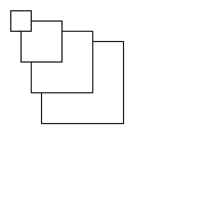
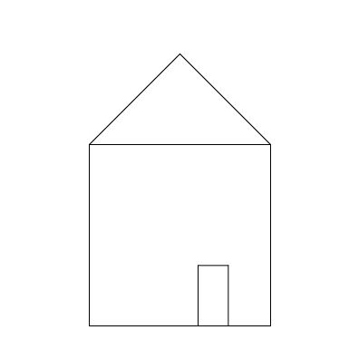
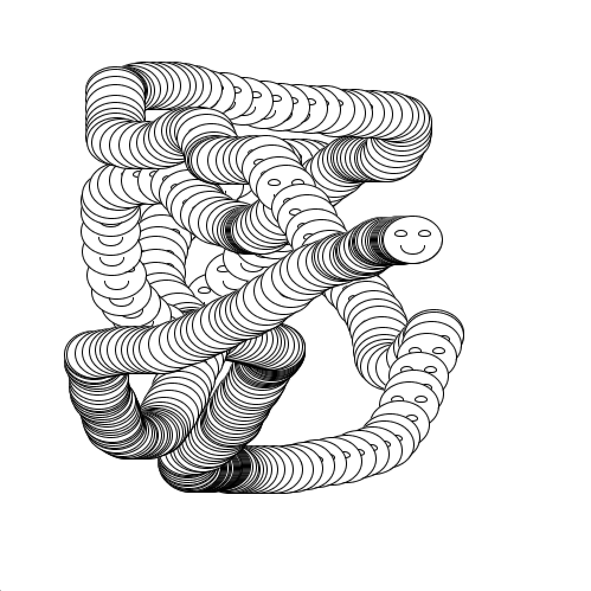
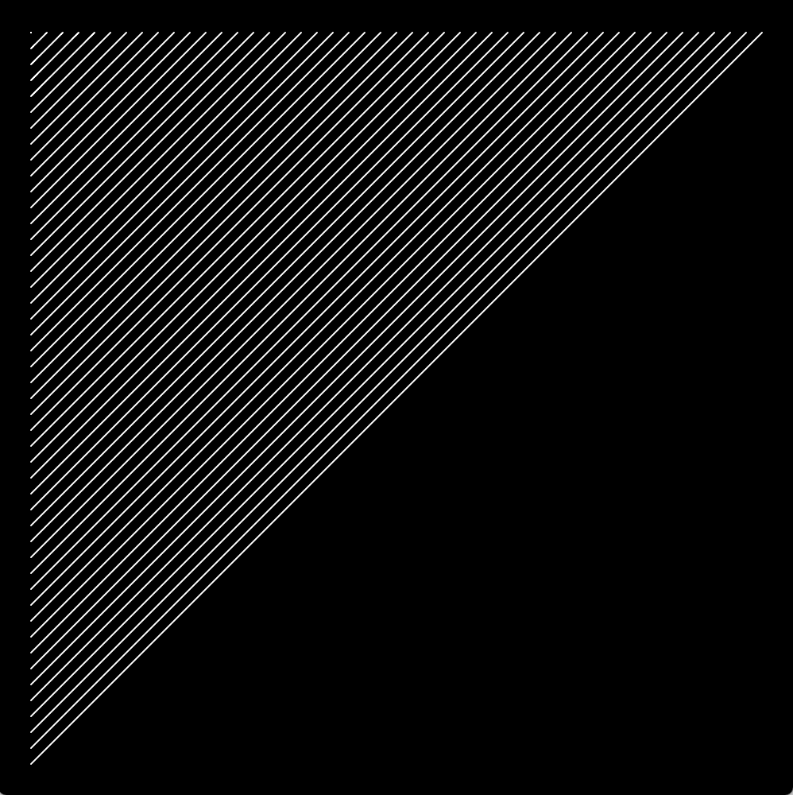
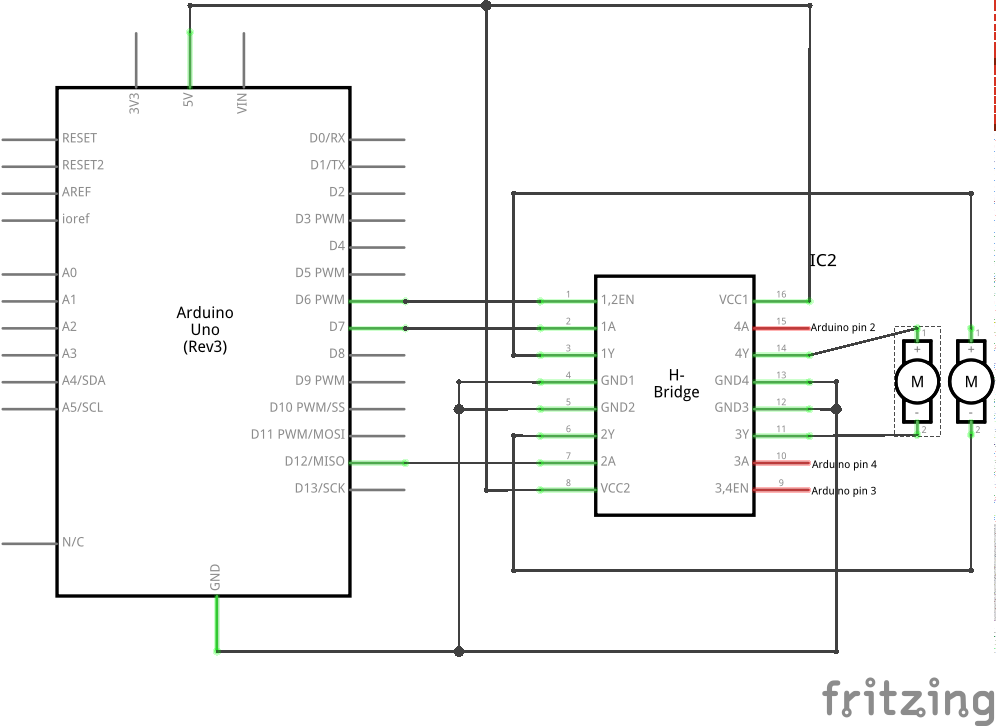

# CCA Programming & Electronics, Fall 2016, Wednesday section

This course repository contains homework assignments, useful guides, and code for "Programming & Electronics" at CCA, Fall 2016, Wednesday section.

Also included in this repository is the official [course syllabus](syllabus.pdf).

### Week 1: Wednesday, September 7, 2016

Lecture:
- Inspirational Videos
- Introductions
- What is programming?
- Goals & course details

Hands-on activities:
- Human Embodiment of Programmer & Robot
  - Programs generally run line-by-line.
  - While loops, if statements, and functions break that up.

Some inspirational videos:
- Basic robots
  - [Coffee-can robot](http://www.youtube.com/watch?v=b0mIshBIbvI#t=24)
  - [Tree-climbing robot](http://www.youtube.com/watch?v=zkpH1BjD6Wc)
  - [Self-balancing robot](http://www.youtube.com/watch?v=Tw9Jr-SPL0Y)
  - [Insect robot](http://www.youtube.com/watch?v=tOsNXg2vAd4#t=120)
  - [Treadbot](http://www.youtube.com/watch?v=YblSltHDbIU)
  - [Velociraptor robot](http://www.youtube.com/watch?v=lPEg83vF_Tw)
- Installations
  - [The Bay Lights](http://thebaylights.org/)
  - [Murmur Wall](http://www.future-cities-lab.net/projects/#/murmurwall/)
  - [Floating Couch](http://vimeo.com/72826106)
  - [Wooden Segment Mirror](https://www.youtube.com/watch?v=BZysu9QcceM#t=36)
  - [Generative design](https://www.youtube.com/watch?v=pNkz8wEJljc)
- Art & Music bots
  - [Textile weaving](https://vimeo.com/71044541)
  - [ReacTable](https://www.youtube.com/user/marcosalonso)
  - [Projection mapping](https://www.youtube.com/watch?v=czuhNcNU6qU)
  - [Laser harp](http://www.youtube.com/watch?v=sLVXmsbVwUs#t=20)
  - [Cubli: Floating Cube](https://www.youtube.com/watch?v=n_6p-1J551Y)
  - [Arc-o-matic](http://vimeo.com/57082262#at=130)
  - [Robo Faber](http://vimeo.com/78771257)
  - [Eggbot](https://www.youtube.com/watch?v=w4cdbV2oaEc)
- Drink-makers
  - [Textspresso](http://www.youtube.com/watch?v=kx9D74t7GD8#t=89)
  - [The Inebriator](http://www.youtube.com/watch?v=WqY7fchs7H0)
- Computer Numerical Control (CNC)
  - [Shapoko / tinyg](http://www.youtube.com/watch?v=pCC1GXnYfFI#t=11)
  - [Makerbot Replicator](http://www.youtube.com/watch?v=NAbiAzYhTOQ)
- Vacuuming
  - [Roomba](https://www.youtube.com/watch?v=0DNkbZvVYvc)

[Homework for Week 1](hw/week1.md)

### Week 2: Wednesday, September 14, 2016

Lecture:
- Homework Review

Workshop:

Together, we'll write code to generate this image:



Lab:
#### Sketching with P5.js

1.  Rewrite the following code without using a loop:

    ```javascript
    function setup() {
      createCanvas(200, 200);
      background(255);

      var i = 0;
      while (i < 7) {
        line(10+i*30, 10, 10+i*30, height-10);
        i = i + 1;
      }    
    }
    ```

2.  Rewrite the following code using a `while` or `for` loop:

    ```javascript
    function setup() {
      createCanvas(200, 200);
      background(255);

      line(10, 10, 20, 10);
      line(20, 20, 30, 20);
      line(30, 30, 40, 30);
      line(40, 40, 50, 40);
      line(50, 50, 60, 50);
      line(60, 60, 70, 60);
      line(70, 70, 80, 70);
      line(80, 80, 90, 80);
      line(90, 90, 100, 90);
      line(100, 100, 110, 100);
      line(110, 110, 120, 110);
      line(120, 120, 130, 120);
      line(130, 130, 140, 130);
      line(140, 140, 150, 140);
      line(150, 150, 160, 150);
      line(160, 160, 170, 160);
      line(170, 170, 180, 170);
      line(180, 180, 190, 180);
    }
    ```

#### Recreating Sketches

1. 

2. 

3. 

4. 

5. [](http://www.youtube.com/watch?v=jWNXFlGHuPA)

6. 

6. Look through the [P5js reference](http://p5js.org/reference/). Pick a function, and use it in a new sketch of your own choosing.

[Homework for Week 2](hw/week2.md)

### Week 3: Wednesday, September 21, 2016

In class:

- Homework review

- Loops review

In class, we reviewed one way of thinking about how to create a loop. We developed the following process:

1. Write down the coordinates of the shapes you want to create in your loop.
2. Find the pattern for those coordinates
  a. Where does it start?
  b. Where does it end?
  c. How much does it change each time?
  
For example, to create the following sketch:



...start by writing down some endpoints for those lines:

```
(20, 20) -> (20, 20)
(20, 30) -> (30, 20)
(20, 40) -> (40, 20)
(20, 50) -> (50, 20)
(20, 60) -> (60, 20)
(20, 70) -> (70, 20)
(20, 80) -> (80, 20)
.
.
.
(20, 480) -> (480, 20)
```

...from these coordinates, we can find a pattern for each of the four parameters we need to draw a line:

- `startX`: always 20
- `startY`: starts at 20, ends at 480, goes up by 10 each time
- `endX`: starts at 20, ends at 480, goes up by 10 each time
- `endY`: always 20

...from this pattern, we can generate a loop that draws these lines, by creating a variable that starts at `20`, ends at `480`, and goes up by `10` each time. We won't call the variable `x` or `y` beacuse we don't use it exclusively for either coordinate.

```javascript
for (var i = 20; i <= 480; i = i + 10) {
  var startX = 20;
  var startY = i;
  var endX = i;
  var endY = 20;
  line(startX, startY, endX, endY);
}
```

You'll explore a few more similar puzzles in the homework!

[Homework for Week 3](hw/week3.md)

### Week 4: Wednesday, September 28, 2016

Homework Review
- No major issues! Make sure you understand conceptually how nested loops work.

Lecture

1.  Animations!
    
    We wrote some basic code for a circle bouncing back and forth horizontally across the canvas:
    
    ```javascript
    var x;
    var speed;
    
    function setup() {
      createCanvas(200, 200);
      x = 0;
      speed = 3;
    }
    
    function draw() {
      background(255);
      ellipse(x, 50, 20, 20);
      x = x + speed;
    
      // x+10: right edge of the circle
      if (x+10 >= width) {
        speed = -3;
      }
      // x-10: left edge of the circle
      if (x-10 <= 0) {
        speed = 3;
      }
    }
    ```
    
    Then, we added a y-coordinate so that the circle can move independently in the `x` and `y` directions. Below, we also renamed `speed` as `vx` and `vy`, represending velocity in the `x` and `y` directions:
    
    ```javascript
    var x, y;
    var vx, vy;
    
    function setup() {
      createCanvas(200, 200);
      x = width/2;
      y = height/2;
      vx = 3;
      vy = 2;
    }
    
    function draw() {
      background(255);
      ellipse(x, y, 20, 20);
      x = x + vx;
      y = y + vy;
    
      // x+10: right edge of the circle
      if (x+10 >= width) {
        vx = -abs(vx);
      }
      // x-10: left edge of the circle
      if (x-10 <= 0) {
        vx = abs(vx);
      }
    
      // y+10: bottom edge of the circle
      if (y+10 >= width) {
        vy = -abs(vy);
      }
      // y-10: top edge of the circle
      if (y-10 <= 0) {
        vy = abs(vy);
      }
    }
    ```
    
2.  Arrays!

    We then extended this code using arrays, so that we could have 400 circles all at once, without needing 400 variables. (We also added a fifth variable per circle, for color.)
    
    ```javascript
    var x = [];
    var y = [];
    var vx = [];
    var vy = [];
    var c = [];

    var numCircles = 1000;

    function setup() {
      createCanvas(600, 600);
    
      colorMode(HSB);
    
      for (var i = 0; i < numCircles; i = i + 1) {
        x.push(random(width));
        y.push(random(height));
        vx.push(random(-4, 4));
        vy.push(random(-4, 4));
        c.push(color(random(360), 100, 100));
      }
    }

    function draw() {
      background(255);
      for (var i = 0; i < numCircles; i = i + 1) {
        noStroke();
        fill(c[i]);
        ellipse(x[i], y[i], 20, 20);
    
        x[i] = x[i] + vx[i];
        y[i] = y[i] + vy[i];
    
        // x+10: right edge of the circle
        if (x[i] + 10 >= width) {
          vx[i] = -abs(vx[i]);
        }
        // x-10: left edge of the circle
        if (x[i] - 10 <= 0) {
          vx[i] = abs(vx[i]);
        }
        // y+10: bottom edge of the circle
        if (y[i] + 10 >= height) {
          vy[i] = -abs(vy[i]);
        }
        // y-10: top edge of the circle
        if (y[i] - 10 <= 0) {
          vy[i] = abs(vy[i]);
        }
      }
    }
    ```
    
3.  Following the mouse.
    
    Finally, we wrote some code to make a circle follow the mouse. After a few iterations, we ended up with the following:
    
    ```javascript
    var x, y;
    var vx, vy;

    function setup() {
      createCanvas(600, 600);
      x = width/2;
      y = height/2;
      vx = 0;
      vy = 0;
    }

    function draw() {
      background(255);
      fill("red");
      noStroke();
      ellipse(x, y, 10, 10);
    
      x = x + vx;
      y = y + vy;
    
      var d = dist(x, y, mouseX, mouseY) / 10; // turns out this line is optional! 
    
      var dx = mouseX - x;
      var dy = mouseY - y;
    
      vx = dx/10;
      vy = dy/10;
    }
    ```
    
    This code sets the speed in the `x` and `y` directions to be 10% of the distance between the `mouseX` and `mouseY` coordinates and the current `x` and `y`. That way, each frame the circle will cover 10% of the distance remaining.


[Homework for Week 4](hw/week4.md)

### Week 5: Wednesday, October 5, 2016

Homework Review

- We reviewed arrays and the homework assignments

Lecture

- We introduced Arduino. 

  - We installed the Arduino software and tested basic functionality using the
blink example (File -> Examples -> Basics -> Blink)

  - We changed the value in the delay() function to change the blink rate

	- We learned how the solderless breadboard works, and we used it to add an external LED

	- We moved the external LED to a different pin, and learned what changes we needed to make to the program to make the external LED on a different pin blink

	- We modified the program further so that both the built-in LED as well as the external LED would blink, and we discussed different blinking patterns.

	- We then moved from output to input, and built a circuit using a light sensor (specifically, an LDR or Light Dependent Resistor). We learned how to use the serial monitor to view numbers that were being sent from Arduino to the laptop.


[Homework for Week 5](hw/week5.md)

### Week 6: Wednesday, October 12, 2016

Homework Review

- Great discussion of extremely tangential electrical principles
- Review LDR circuit, explain voltage divider, explain potentiometer

Lab

- Do analogReadSerial example with potentiometer
- Add servo, do servo knob example
- Explain map() and serial.print()
- Add Serial.print() to see where motor has difficulties
- Change map() to accommodate
- Discussed other programs interacting with data from Arduino
- Demonstrated Processing changing color according to these values. We ran this code in Arduino:
  ```arduino
  void setup() {
    Serial.begin(9600);
  }

  void loop() {
    // print the analog value from pin A0 every 100 milliseconds
    Serial.println(analogRead(A0));
    delay(100);
  }
  ```
  Here's the complementary code for Processing:
  ```processing
  import processing.serial.*;

  Serial port;
  void setup() {
    size(100, 100);
    println(Serial.list());
    
    // you'll need to pick the right port from the list that prints above!
    port = new Serial(this, "/dev/tty.usbmodem411", 9600);
  }

  // store the value outside draw because several frames may pass 
  // between receiving new numbers from the Serial port
  int value = 0;
  void draw() {
    background(map(value, 0, 1023, 0, 255));
    
    if (port.available() > 5) {                // if there's at least a few characters available...
      String in = port.readStringUntil('\n');  // read up to and including a 'newline' character
      
      // trim the string value to lose the newline character (e.g., "123\n" -> "123")
      // then convert what's left into an integer (e.g., "123" -> 123)
      value = int(in.substring(0, in.length()-2));
      
      System.out.println("value is "+value);
    }
  }
  ```


[Homework for Week 6](hw/week6.md)

### Week 7: Wednesday, October 19, 2016

Homework Review

- We looked at a few different ways to write code that does the same thing: turning on two different LEDs at two ends of a range.

Workshop

- We learned about transistors and powering a motor, using an Arduino pin, through a transistor.
- We then built an H-bridge circuit and connected a motor to it, to control the direction of rotation of the motor as well as its speed. Here is the schematic we used (note that this schematic uses different Arduino pins to allow the wires to go straight):


[Homework for Week 7](hw/week7.md)

### Week 8: Wednesday, October 26, 2016

- Review practice quiz
- We added a second motor to our H-bridge:



[Homework for Week 8](hw/week8.md)

[Homework for Week 9](hw/week9.md)

